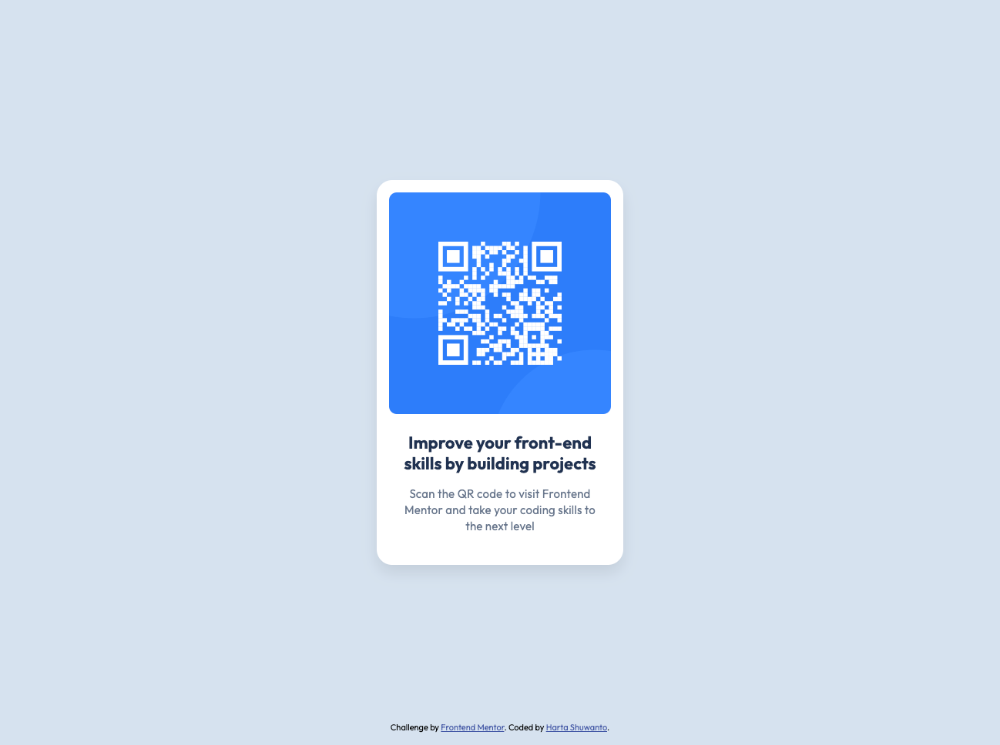

# Frontend Mentor - QR code component solution

This is a solution to the [QR code component challenge on Frontend Mentor](https://www.frontendmentor.io/challenges/qr-code-component-iux_sIO_H). Frontend Mentor challenges help you improve your coding skills by building realistic projects. 

## Table of contents

- [Overview](#overview)
  - [Screenshot](#screenshot)
  - [Links](#links)
- [My process](#my-process)
  - [Built with](#built-with)
  - [What I learned](#what-i-learned)
  - [Continued development](#continued-development)
  - [Useful resources](#useful-resources)
- [Author](#author)
- [Acknowledgments](#acknowledgments)

## Overview

### Screenshot

### Links

- Solution URL: [GitHub](https://github.com/hartashu/qr-code-component)
- Live Site URL: [GitHub Pages](https://hartashu.github.io/qr-code-component/)

## My process

### Built with

- Semantic HTML5 markup
- CSS custom properties
- Flexbox
- CSS grid
- Mobile-first workflow

### What I learned

- Centering card horizontally and vertically.
- Custom properties, CSS units, transform property, position property, and so on.
- Proper semantic HTML (still a lot to learn about this).
- CSS Methology (BEM - Block Element Modifier).

### Continued development

- Semantics HTML and accessibility
- CSS BEM (Block Element Modifier)
- Utility classes in CSS

### Useful resources

Getting started with HTML & CSS:
- [HTML & CSS Course by SuperSimpleDev](https://youtu.be/G3e-cpL7ofc?si=4xxA1hw_5mU_9-aX)

Git & GitHub:
- [Git & GitHub Tutorial by SuperSimpleDev](https://youtu.be/hrTQipWp6co?si=HIO_1gWZHOGBGxDH)

Semantics:
- [HTML Semantics Cheat Sheet](https://learntheweb.courses/topics/html-semantics-cheat-sheet/)

All about CSS:
- [CSS Units](https://youtu.be/-GR52czEd-0?si=qHL5x0IH4GpsBNtq)
- [CSS Transform](https://youtu.be/rzD-cPhq02E?si=MpCFcO-d6k9C4QKo)
- [The difference between max-inline-size and max-width property](https://css-tricks.com/almanac/properties/m/max-inline-size/)
- [CSS Reset](https://www.joshwcomeau.com/css/custom-css-reset/) - CSS reset.
- [Checking alt attribute](https://www.kevinpowell.co/article/a-cool-trick-for-checking-for-alt-attribute/)

All about BEM (Block Element Modifier):
- [Introduction to BEM](https://getbem.com/introduction/)
- [BEM 101](https://css-tricks.com/bem-101/)
- [BEM by Varvara from Yandex](https://www.smashingmagazine.com/2012/04/a-new-front-end-methodology-bem/#comments-a-new-front-end-methodology-bem)

Responsive Web Design (RWB):
- [Responsive Web Design](https://developer.mozilla.org/en-US/docs/Learn/CSS/CSS_layout/Responsive_Design)
- [Responsive layout by Kevin Powell](https://courses.kevinpowell.co/conquering-responsive-layouts)

## Author

- GitHub - [hartashu](https://github.com/hartashu)
- Frontend Mentor - [@hartashu](https://www.frontendmentor.io/profile/hartashu)

## Acknowledgments

Thanks to everyone who kindly and heartedly share knowledges all over the internet.